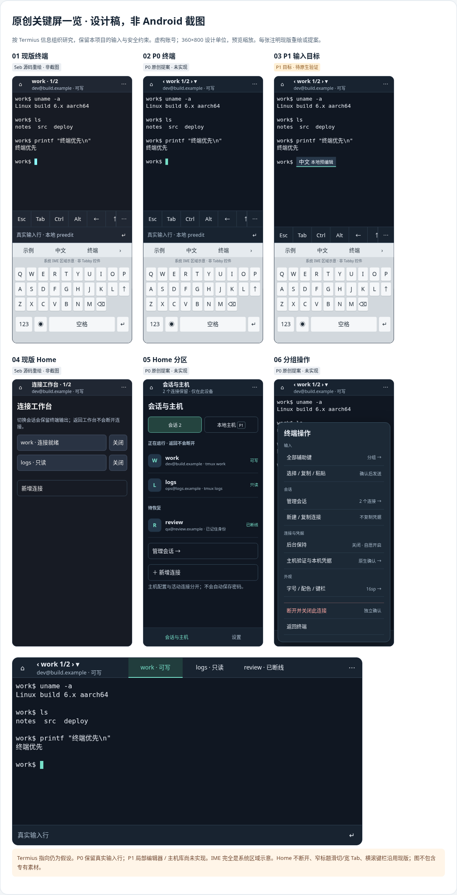

# Android · Termius 参考设计评审

本稿针对 Android 产品提交 `5ebd250a499f6dff52f4713f84ebcbece09b81c7`，研究移动终端的信息组织并提出原创界面。资料编制日期为 **2026-10-08**，文档候选单独交付于 2026-10-09。此次只交付设计评审；P0/P1 均未在产品中实施。

## 阅读与运行

- [关键屏图](Tabby-Android-Termius-Key-Screens.png)：六张手机设计屏和一张展开窗口稿，1096 × 2143 像素。图内区分现版源码重绘、P0 提案和 P1 输入目标，**不是 Android 应用截图**。
- [PDF 评审稿](Tabby-Android-Termius-Review.pdf)：8 页，可下载阅读。
- [离线交互稿](Tabby-Android-Termius-Review.html)：下载后用现代浏览器打开；支持 Home、标题切换、宽屏 Tab、更多操作和 IME 示意切换。无需联网或依赖安装，未连接 SSH，也没有登录、系统权限、凭据读写或输入持久化。
- [SHA256SUMS](SHA256SUMS)：三份原始交付文件的完整校验值。下载到同一目录后可运行 `sha256sum -c SHA256SUMS`。

## 建议的分阶段范围

**P0**：Home 区分活动连接与待恢复 tmux；标题增加方向与选择暗示，宽屏 Tab 标注连接/读写状态；更多操作分成输入、会话、连接与凭据、外观，并独立放置危险断开。IME 关闭或外接键盘时默认收起辅助键栏，保留真实 48dp 输入行；断线保留旧输出为只读，明确恢复入口。使用原创 Android UI tokens，不改共享 ANSI 色板或 Linux 配色。

**P1**：本地命名主机库，以及局部可见 IME 编辑器，分别作为后续候选。主机元数据需原生 noBackup 存储及凭据引用；输入方案必须通过原生焦点、composition、中文输入、选择、触控与输入租约验收，才能减少常驻编辑行。

估算采用 360 × 800dp 可用窗口和 300dp IME，均是设计假设。P0 在 IME 打开时仍保留辅助键和真实输入行，**没有宣称面积收益**；IME 关闭时收键栏可增加 48dp。P1 的 IME 打开面积目标仍未实现，也不是 OPPO Find N6 的实测尺寸。

沿用 SSH/tmux 列表、重名与不存在报错、只读与显式接管、安全主机校验、软键盘、触控、多会话、后台通知停止及本机可选凭据管理。应用内 Home 只是导航；系统 Home/后台仍服从用户的后台保持选择，不能承诺系统杀进程后连接存活。完整交互和后续验收清单见 PDF/HTML。

## 研究边界与来源

“terminus” 仍有指向歧义：Tabby 旧名也是 Terminus。本稿按 **Termius 移动 SSH 客户端**这一假设研究，不能把交付设计资料视为已确认参考对象或已批准实施。

来源核对日期：2026-10-08。下表仅链接第一方公开资料；没有安装或运行 Termius。官网原图下载失败，未做像素审阅，也未从图片提取颜色、触控尺寸或实际手感。其 Mobile terminal 文档开头明确 iOS/iPadOS，相关键组/主题/手势只作跨平台参考。

| 来源 | 采用的依据与限制 |
| --- | --- |
| [S1 · Termius Android 产品页](https://termius.com/free-ssh-client-for-android) | Android 定位、多会话和附加键栏；官网插图版本未知，未像素审阅。 |
| [S2 · Termius Android 更新记录](https://docs.termius.com/changelog/android) | 2026-09-28 的 7.11.0 新终端/附加键栏；2025-03-12 的 7.0.0 手机底部导航/平板顶部导航。功能记录不等于实测触控或 IME。 |
| [S3 · Groups and tags](https://docs.termius.com/organize-and-connect-to-hosts/groups-and-tags) | 主机组织及 Mobile 操作；部分示例为桌面。只借鉴分类，不引入凭据继承或批量连接。 |
| [S4 · Mobile terminal](https://docs.termius.com/terminal/mobile-terminal) | 页首限定 iOS/iPadOS，不能当作 Android 实测。 |
| [S5 · Android 窗口尺寸类别](https://developer.android.com/develop/ui/views/layout/use-window-size-classes) | 按当前可用窗口调整导航，不能按设备型号硬编码。 |
| [S6 · Android 无障碍](https://developer.android.com/guide/topics/ui/accessibility/apps) | 48dp 触控目标、可读标签与文字对比。 |

产品对照使用 [固定 5ebd250a 源码](https://github.com/Mafei/tabby/tree/5ebd250a499f6dff52f4713f84ebcbece09b81c7/mobile)，设计对照使用 [固定 667663db 设计](https://github.com/Mafei/tabby/tree/667663dbeb6b8439dd26471a3fa0be64ab814d7f/docs/design/android-mobile-ux)。[固定产品 README](https://github.com/Mafei/tabby/blob/5ebd250a499f6dff52f4713f84ebcbece09b81c7/README.md) 说明 formerly Terminus；[PR6](https://github.com/Mafei/tabby/pull/6) 保留原产品及其 Android 证据。667 的输入面积目标没有被重新标为已实现。

## 原创性、数据与验证

三份文件直接保留上一轮交付字节。画面由本项目 HTML/CSS 和虚构 `.example` 主机生成，未嵌入 Termius 的商标、截图、专有图标或其他下载素材。HTML 里的公开插图地址只是点击来源链接；没有自动外部资源请求。没有真实凭据、私人主机、联系人或用户数据；未发现私钥或令牌标记。

离线浏览器验证记录有 9 项通过：界面渲染无脚本错误、Home 保留两条模拟会话、只读状态不显示 IME、窄标题拖动仅切邻居且不打开选择单、键栏拖动不触发键、宽屏 Tab 切换、断线旧输出只读对照、P0 关闭 IME 时隐藏键栏且保留输入行，以及无自动外部请求。外部请求与脚本错误均为 0。正文/次级/强调色在 `#101722` 上对比分别为 15.29、9.14、11.27。

PDF 8 页与关键屏图已检查可读；发布时再次校验文件字节、完整 SHA256 和文档范围。上述检查仅针对离线设计，不等于 Android 原生输入或真机验收。本轮不重跑产品 CI、不修改 PR6 head、不生成或安装 APK、不操作真实 SSH 服务器、不合并或发布产品。

AI disclosure: **fully vibe coded** by an AI coding agent.
